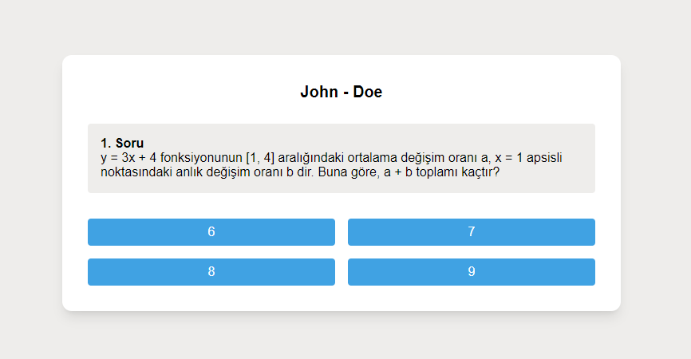

# ENV Manager



This project is a competition application from specific questions. React, redux and tailwind were used.

**Warning**: This project is a test application created to be used in high school, primary school, etc.

## Usage

1. Clone your project:

```
git clone https://github.com/furkancansimsek/QuizApp
cd QuizApp
```

2. Install the project dependencies:

```
npm install
```

3. Run the project files:

```
npm run dev
```

## Features

- **Login Screen**: There is a simple login screen and a page where you can enter your name and class.
- **Results Page**: There is a separate page where you can view your answers.
- **Adding and Editing Questions**: You can edit the questions in the `src/utils/questions.js` file.

## Development

Follow the steps below for the development of the project:

1. Switch to the development branch:

```
git checkout development
```

2. Add new features or fix bugs.

3. Make your changes and submit a pull request.

## Contributing

If you want to contribute to this project, please submit a merge request. You can contribute to add new features, fix bugs or improve the documentation.